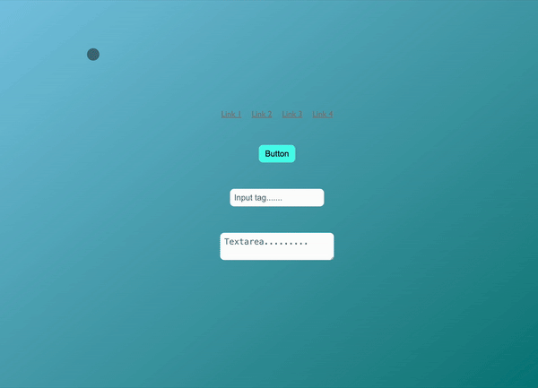

# Custom Cursor with Dynamic Hover Effects 🎨

This project provides a simple implementation of a custom round cursor with dynamic shape changes and smooth animations when hovering over different HTML elements such as links, buttons, input fields, and text areas.

## 🌟 Features
- **Custom Round Cursor**: The native cursor is replaced with a smooth, round cursor that follows the mouse movements.
- **Dynamic Shape Changes**: The cursor changes its shape based on the hovered element:
  - Becomes a vertical line over input fields and text areas.
  - Adapts to the size and shape of links and buttons.
- **Smooth Hover Animations**: Links and buttons apply shadow, color, and scale transformations upon hovering.
- **Easily Configurable**: Configurations for link and button hover effects (color, shadows) are controlled through an external `config.json` file.

## 🚀 How to Use

### 1. Add the Required Files
Make sure the following files are in your project or copy it's content to your project files:
- `style.css`
- `script.js`
- `config.js`

### 2. Configuration
The config.json file allows you to easily adjust the hover effects for links and buttons. Modify the following properties as per your preference:

- **link.onHoverColor** - Color of the text when hovering over a link.
- **link.shadow** - Shadow properties for links when hovered.
- **button.onHoverColor** - Color of the text when hovering over a button.
- **button.onHoverBgColor** - Background color of the button when hovered.
- **button.shadow** - Shadow properties for buttons when hovered.